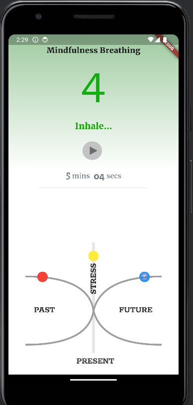

# Mindfulness Breathing App

This Flutter application helps users practice mindfulness breathing exercises.

## Features

- **Breathing Timer:** Allows users to set and track breathing sessions.
- **Visual Guides:** Provides visual cues and instructions for inhaling and exhaling.
- **Statistics:** Tracks and displays session durations and progress.

## Screenshots


## Installation

Follow these steps to run the app locally:

1. Clone the repository:

```
git clone https://github.com/StephCurry07/mindfulness_breathing_app.git
```

2. Navigate to the project directory:

```
cd mindfulness_breathing_app
```

3. Install dependencies:
`flutter pub get`


4. Run the app:

```
flutter run
```

## Dependencies

- **flutter:** 3.3.2 or higher
- **google_fonts:** ^6.0.1

Ensure you have Flutter installed and configured on your system.

## Usage
Just a single page.


